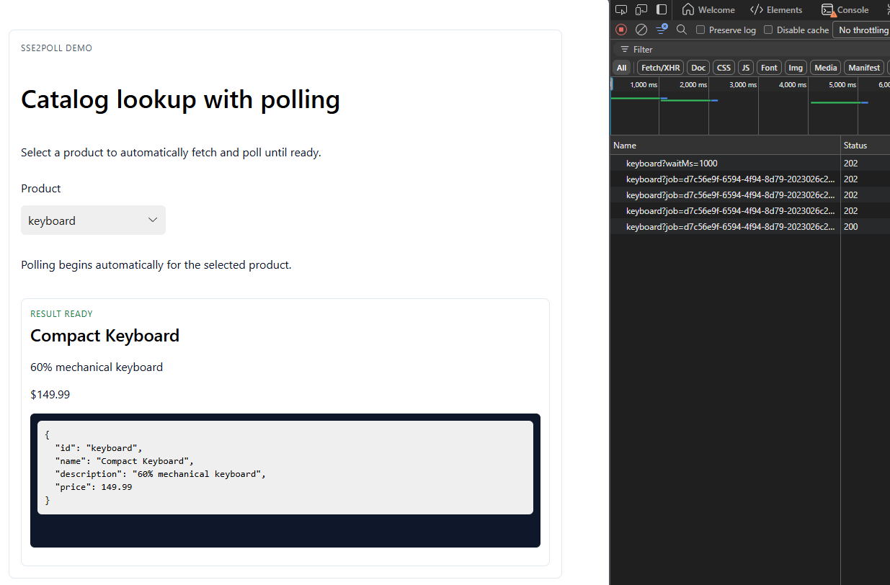

# SSE2Poll

SSE2Poll turns slow GET endpoints into a robust long-poll workflow. The Java core library adds an `@PolledGet` annotation that orchestrates kickoff + polling with a cache and async execution; the Angular client ships a lightweight interceptor that turns `202 { jobId }` responses into hands-free polling until the payload is ready.

The goal: simulate a “server-push” experience (akin to SSE) in environments where real server-sent events aren’t allowed—e.g., locked-down enterprises or proxies that only permit plain polling. SSE2Poll gives you resilient, wait-aware polling for long operations without needing native SSE support.

## Repository layout
- `core/`: Java library for Spring/Spring Boot apps (`@PolledGet`, Caffeine-backed cache, async runner).
- `client/`: Angular polling client (`@sse2poll/polling-client`).
- `example/`: Demo Spring Boot API (`example/api`) and Angular UI (`example/angular-client`).

## How the libraries work
- Backend flow:
  - Annotate a controller method with `@PolledGet`. The aspect inspects the `job` (existing poll) and optional `waitMs` (server-side wait) query params.
  - Kickoff: a job id is generated, a `Pending` envelope is written to the cache (default Caffeine, 5 minute TTL, max ~10k entries), and the computation is run on a virtual thread. The coordinator optionally waits up to `waitMs` before responding.
  - If the payload is not ready yet, a `202 { "jobId": "<id>" }` response is returned; when ready, the cache entry is deleted and the original return type is sent with `200`.
  - Polling with `?job=<id>` (and optional `waitMs`) reuses the same entry: returns `200` when ready, `202` while pending, or `404` if the job expired/never existed.
- Angular client flow:
  - Register the `pollingInterceptor` with Angular's `provideHttpClient` and opt in per call via `withPolling({ waitMs?, pollIntervalMs?, maxPollAttempts? })`.
 - Kickoff requests act like normal HTTP calls. When a `202 { jobId }` is seen, the interceptor polls the same URL with `job` (and `waitMs` if provided) until a `200` payload is returned.
  - The caller only receives the final ready response; polling failures (404, max attempts) surface as `HttpErrorResponse`.

## Try the demo
1. Build the Angular polling client once: `cd client && npm install && npm run build && npm pack`.
2. Start the Spring Boot API: `cd example/api && ./mvnw spring-boot:run` (or `mvnw.cmd` on Windows).
3. Start the Angular UI: `cd example/angular-client && npm install ../client/sse2poll-polling-client-0.1.2.tgz && npm start`.
4. Open `http://localhost:4200`, choose a product, and watch the long-running request resolve via polling. Screenshots live in `example/angular-client/README.md`.
- API-only quick test: open `example/api/catalog.http` in an HTTP client (VS Code REST Client, IntelliJ HTTP, or curl), kick off the catalog request, then paste the returned `jobId` into the poll request to see the 202→200 transition without the UI.

